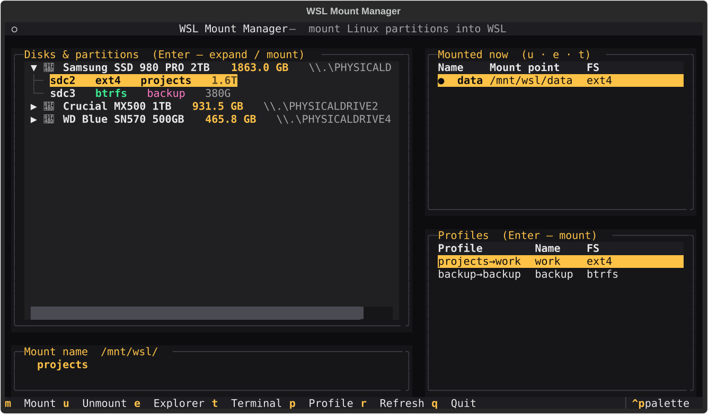

# WSL Mount Manager


A fast, keyboard-driven terminal UI for mounting Linux disk partitions into **WSL2**
on Windows. Single Python file, one dependency.



## Why

WSL can mount real Linux partitions with `wsl --mount`, but doing it by hand means
juggling `Get-CimInstance`, `wsl --mount --bare`, `lsblk`, partition numbers and
filesystem types in an elevated shell. This wraps all of that in a TUI: pick a disk,
pick a partition, press Enter.

## Features

- **Any filesystem lsblk recognizes** — ext4/ext3/btrfs/xfs/vfat/…, not just ext4.
- **Mount many at once** — several disks *and* several partitions of the same disk
  can be mounted simultaneously, each under its own `/mnt/wsl/<name>`.
- **Select, then act** — moving to / clicking a partition only selects it; the
  footer then highlights the available action (Mount / Unmount). Enter or the
  footer key performs it. Up, down, Enter, done.
- **Named profiles** — save a disk + partition + mount-name combo and remount it with
  a single keystroke.
- **Live status** — see what is mounted under `/mnt/wsl/`, auto-refreshed.
- **One-key actions** — open a mount in Windows Explorer or a WSL terminal.
- **Command palette & menu** — `Ctrl+P` fuzzy-searches the actions valid for the
  focused panel; `Ctrl+O` opens a menu (theme · keys · screenshot · quit).
- **Many built-in themes** — a custom near-black `mounter-dark` plus a dozen popular
  themes (Tokyo Night, Gruvbox, Everforest, Kanagawa, Ayu, Night Owl, GitHub,
  Material, Synthwave '84, Cobalt2, …). A live-preview picker (`Ctrl+T`) re-themes
  the whole app as you scroll the list, and your choice is remembered.
- **Auto-elevation** — requests UAC and relaunches itself; no need to open an admin
  shell first.

## Requirements

- Windows 10/11 with **WSL2** and at least one distro installed.
- **Python 3.9+**.
- **[textual](https://github.com/Textualize/textual)** (`pip install textual`).
- Administrator privileges (handled automatically via UAC).

## Install & run

```powershell
pip install textual
python mounter.py
```

That's all — it's a single self-contained file.

## Keys

| Key      | Action                                                        |
| -------- | ------------------------------------------------------------- |
| ↑ / ↓    | Move through the disks → partitions tree                      |
| Enter    | On a disk: expand. On a partition: mount it (or unmount if mounted) |
| Tab      | Switch focus: tree / Mounted / Profiles                       |
| `m`      | Mount the selected partition                                  |
| `u`      | Unmount the selected mount                                    |
| `e`      | Open the selected mount in Windows Explorer                   |
| `t`      | Open a WSL terminal at the selected mount                     |
| `p`      | Save the selected partition *or* mounted entry as a profile   |
| `d`      | Delete the selected profile (focus the Profiles panel first)  |
| `r`      | Refresh                                                       |
| `+` / `-`| Maximize / restore the focused panel                          |
| `?`      | Toggle the keys / help panel                                  |
| `Ctrl+T` | Theme picker (live preview, remembered)                       |
| `Ctrl+S` | Save a screenshot (SVG)                                        |
| `Ctrl+O` | Menu (theme · keys · screenshot · quit)                       |
| `Ctrl+P` | Command palette (fuzzy-search the focused panel's actions)    |
| `q`      | Quit                                                          |

The **Mount name** field sets the folder name under `/mnt/wsl/`; it is prefilled from
the partition label.

## How it works

- Lists physical disks via `Win32_DiskDrive` (PowerShell).
- `wsl --mount --bare` + `lsblk -OJ` enumerate a disk's partitions and filesystems.
- A partition is mounted by attaching its disk once (`wsl --mount --bare`) and then
  mounting it inside WSL as root (`mount /dev/<part> /mnt/wsl/<name>`); unmounting is
  a plain `umount`. This is what lets multiple partitions of one disk coexist.
- State (last selection, profiles, and each active mount's disk/partition) lives in
  `~/.wsl-mount-manager/`.

## Notes

- Unmounting needs the Windows disk id. The app knows it only for mounts it created
  (tracked in `~/.wsl-mount-manager/active.json`). For mounts made elsewhere, unmount
  manually: `wsl --unmount <DeviceID>`.
- `wsl --mount` attaches whole physical disks to WSL; a disk in active use by Windows
  (e.g. with a mounted NTFS volume) or the system disk cannot be bare-mounted.

## License

[MIT](LICENSE)
